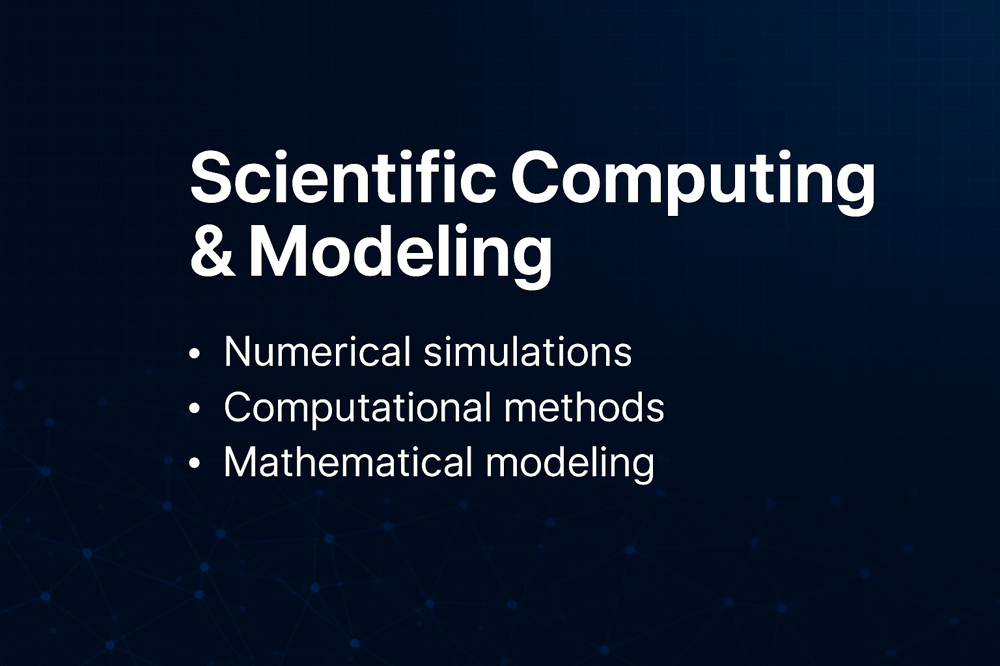
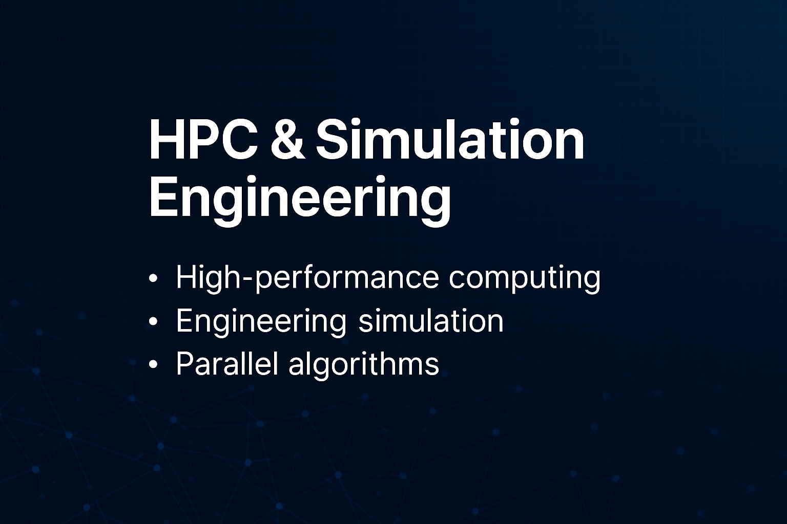

  

# 📘 Kishore D. B. — Research & Engineering Portfolio

Welcome to my consolidated **Research, Engineering & Applied AI Portfolio**.  
This repository collects work across **AI platforms**, **scientific ML**, and **cloud-native computational systems**, and it documents selected works, supporting research, publications, talks, patents, and technical projects.

---

## 🔍 Contents

1. **Selected Works** — Flagship contributions with high research or engineering impact.  
   → [`selected-works.md`](./selected-works.md)

2. **Supporting Works** — Case studies, prototypes, experiments, and extended technical notes.  
   → [`supporting-works.md`](./supporting-works.md)

3. **Publications** — Articles, whitepapers, peer-reviewed content, and technical reports.  
   → [`publications.md`](./publications.md)

4. **Talks & Presentations** — Invited talks, lectures, and conference presentations.  
   → [`talks.md`](./talks.md)

5. **Patents & Invention Disclosures** — Filed / drafted IP entries.  
   → [`patents.md`](./patents.md)

6. **Technical Projects** — Platforms, prototypes, libraries, demos, and experiments.  
   → [`tech-projects.md`](./tech-projects.md)

7. **Portfolio Metadata (machine-readable)** — JSON indexes for automation and export:  
   - [`selected-works.json`](./selected-works.json)  
   - [`supporting-works.json`](./supporting-works.json)  
   - [`publications.json`](./publications.json)

---

## 🧠 Research Focus Areas

  
  
  

**AI & Machine Learning**  
Representation learning • Scientific ML • Process modeling & optimization • XAI • Healthcare AI • Clinical NLP

**Computational Systems**  
Cloud-native simulation & optimization pipelines • Distributed training • Scalable inference • Data orchestration

**Engineering & Architecture**  
Platform strategy • API ecosystems • Microservices • High-availability systems • R&D frameworks

---

## ⭐ Signature Contributions (high level)

- **AI Platform for Financial & Scientific Workflows**  
  Architected cloud-native pipelines integrating ML toolkits, numerical solvers, optimization engines, reproducibility workflows, and XAI layers. Adopted across 3,400+ institutions.

- **Clinical Analytics & Healthcare ML Modules**  
  Developed clinical prediction frameworks (medical NLP, risk modeling, EHR-compatible data layers, outcome prediction).

- **Lending Intelligence Systems**  
  Designed rule- and ML-driven systems for credit scoring, adjudication, document intelligence, and process optimization.

---

## 📈 Included Artifacts

Within this repository you will find architecture diagrams, platform blueprints, end-to-end workflow explanations, benchmark summaries, and experiment logs. See the documentation in the `docs/` folder (if present) for PDFs and extended technical reports.

---

## 📚 Recommended entry points for reviewers

1. Start with **Selected Works** (`selected-works.md`) — flagship research/engineering items.  
2. Read **Talks** (`talks.md`) — narrative explanations of research direction.  
3. Inspect **Technical Projects** (`tech-projects.md`) — reproductions or demos.  
4. Review **Publications** (`publications.md`) — formal outputs.  
5. Use the JSON indices for automated export or import (`*.json`).

---

## 🌐 External Profiles & Citation

- **ORCID:** https://orcid.org/0009-0003-3116-5000  
- **GitHub:** https://github.com/kishoredb  
- **LinkedIn:** Available on request

If you reuse or cite artifacts from this repository, please use the DOI/CITATION suggested in `CITATION.cff` or contact me at `kishoredb@gmail.com`.

---

## 📨 Contact

**Kishore D. B.** — `kishoredb@gmail.com`  
Open to collaborations in **AI platforms**, **scientific ML**, **computational intelligence**, and **R&D architecture**.

---
