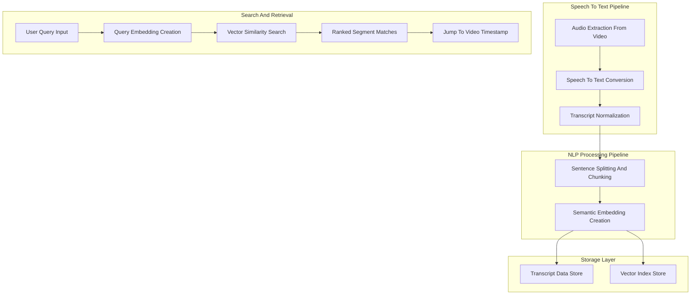

```mermaid
flowchart TD

    %% AEGIS Speech to Text
    subgraph STT [Speech To Text Pipeline]
        A1[Audio Extraction From Video]
        A2[Speech To Text Conversion]
        A3[Transcript Normalization]
    end

    %% AEGIS NLP Processing
    subgraph NLP [NLP Processing Pipeline]
        A4[Sentence Splitting And Chunking]
        A5[Semantic Embedding Creation]
    end

    %% AEGIS Storage
    subgraph STORAGE [Storage Layer]
        A6[Transcript Data Store]
        A7[Vector Index Store]
    end

    %% AEGIS Search
    subgraph SEARCH [Search And Retrieval]
        Q1[User Query Input]
        Q2[Query Embedding Creation]
        Q3[Vector Similarity Search]
        Q4[Ranked Segment Matches]
        Q5[Jump To Video Timestamp]
    end

    A1 --> A2 --> A3 --> A4 --> A5
    A5 --> A6
    A5 --> A7

    Q1 --> Q2 --> Q3 --> Q4 --> Q5
```
