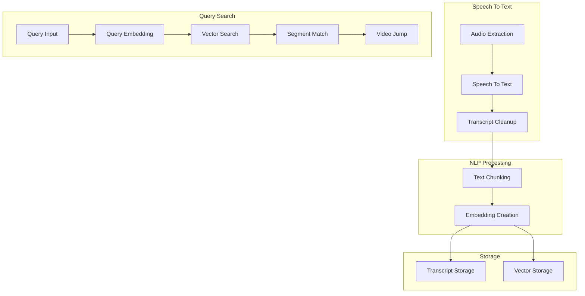

```mermaid
flowchart TD

    %% AEGIS.STT group
    subgraph STT [Speech To Text]
        A1[Audio Extraction]
        A2[Speech To Text]
        A3[Transcript Cleanup]
    end

    %% AEGIS.NLP group
    subgraph NLP [NLP Processing]
        A4[Text Chunking]
        A5[Embedding Creation]
    end

    %% AEGIS.Storage group
    subgraph STORAGE [Storage]
        A6[Transcript Storage]
        A7[Vector Storage]
    end

    %% AEGIS.Search group
    subgraph SEARCH [Query Search]
        Q1[Query Input]
        Q2[Query Embedding]
        Q3[Vector Search]
        Q4[Segment Match]
        Q5[Video Jump]
    end

    A1 --> A2 --> A3 --> A4 --> A5
    A5 --> A6
    A5 --> A7

    Q1 --> Q2 --> Q3 --> Q4 --> Q5
```
