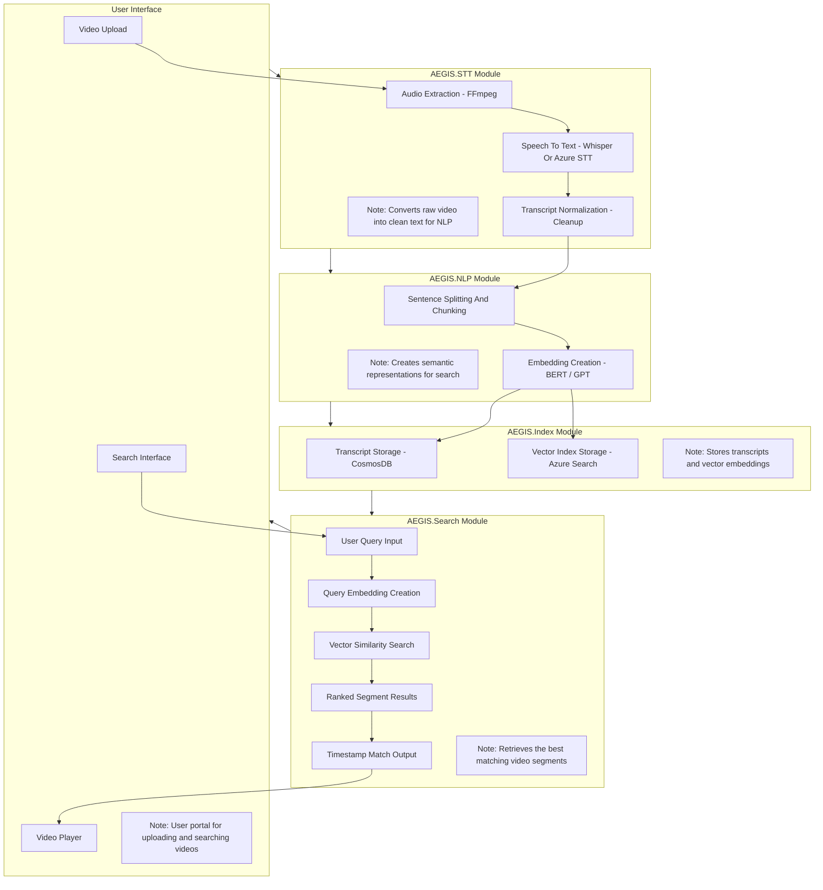

```mermaid
flowchart TB

    %% USER INTERFACE
    subgraph UI [User Interface]
        U1[Video Upload]
        U2[Search Interface]
        U3[Video Player]
        UI_NOTE[Note: User portal for uploading and searching videos]
    end

    %% AEGIS.STT
    subgraph STT [AEGIS.STT Module]
        A1[Audio Extraction - FFmpeg]
        A2[Speech To Text - Whisper Or Azure STT]
        A3[Transcript Normalization - Cleanup]
        STT_NOTE[Note: Converts raw video into clean text for NLP]
    end

    %% AEGIS.NLP
    subgraph NLP [AEGIS.NLP Module]
        A4[Sentence Splitting And Chunking]
        A5[Embedding Creation - BERT / GPT]
        NLP_NOTE[Note: Creates semantic representations for search]
    end

    %% AEGIS.Index
    subgraph INDEX [AEGIS.Index Module]
        A6[Transcript Storage - CosmosDB]
        A7[Vector Index Storage - Azure Search]
        INDEX_NOTE[Note: Stores transcripts and vector embeddings]
    end

    %% AEGIS.Search
    subgraph SEARCH [AEGIS.Search Module]
        Q1[User Query Input]
        Q2[Query Embedding Creation]
        Q3[Vector Similarity Search]
        Q4[Ranked Segment Results]
        Q5[Timestamp Match Output]
        SEARCH_NOTE[Note: Retrieves the best matching video segments]
    end

    %% MODULE FLOW
    UI --> STT --> NLP --> INDEX --> SEARCH --> UI

    %% INTERNAL FLOWS
    U1 --> A1
    A1 --> A2 --> A3 --> A4 --> A5
    A5 --> A6
    A5 --> A7

    U2 --> Q1
    Q1 --> Q2 --> Q3 --> Q4 --> Q5
    Q5 --> U3
```
