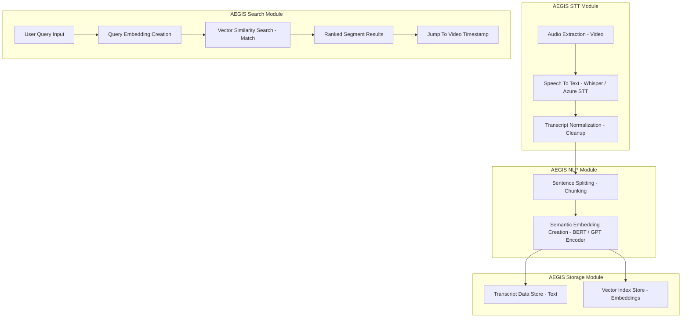

```mermaid
flowchart TD

    subgraph STT [AEGIS STT Module]
        A1[Audio Extraction - Video]
        A2[Speech To Text - Whisper / Azure STT]
        A3[Transcript Normalization - Cleanup]
    end

    subgraph NLP [AEGIS NLP Module]
        A4[Sentence Splitting - Chunking]
        A5[Semantic Embedding Creation - BERT / GPT Encoder]
    end

    subgraph STORAGE [AEGIS Storage Module]
        A6[Transcript Data Store - Text]
        A7[Vector Index Store - Embeddings]
    end

    subgraph SEARCH [AEGIS Search Module]
        Q1[User Query Input]
        Q2[Query Embedding Creation]
        Q3[Vector Similarity Search - Match]
        Q4[Ranked Segment Results]
        Q5[Jump To Video Timestamp]
    end

    A1 --> A2 --> A3 --> A4 --> A5
    A5 --> A6
    A5 --> A7

    Q1 --> Q2 --> Q3 --> Q4 --> Q5
```
