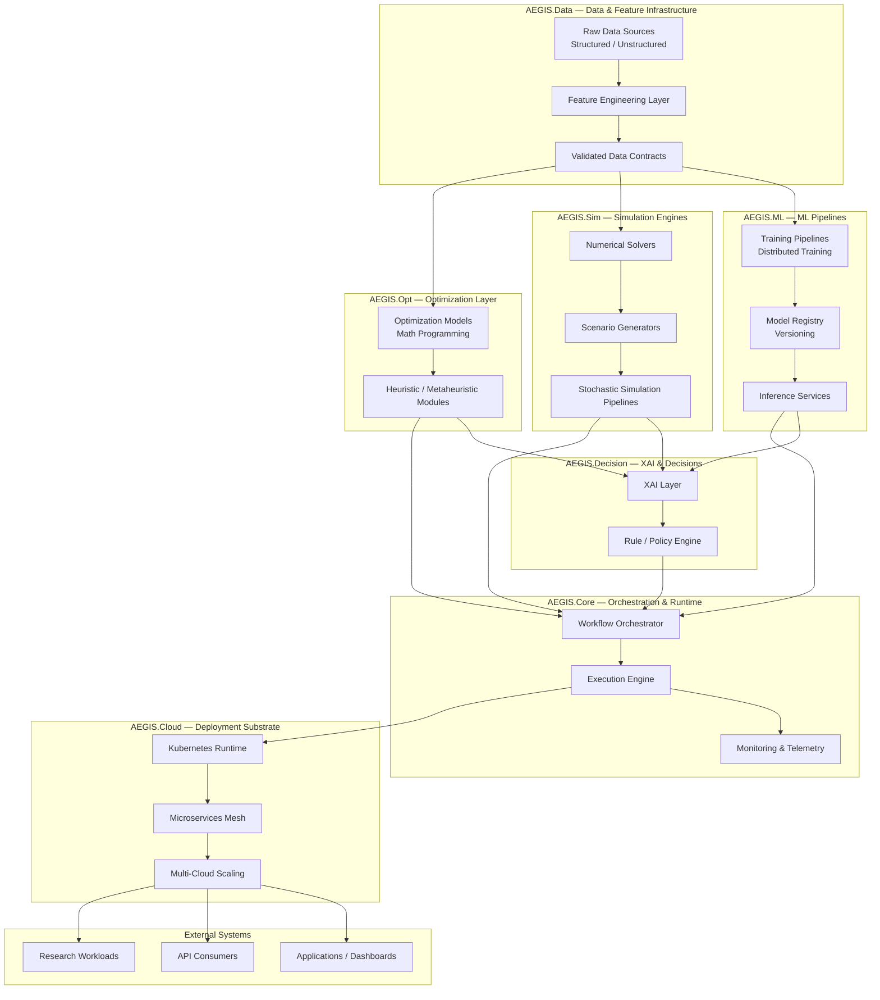
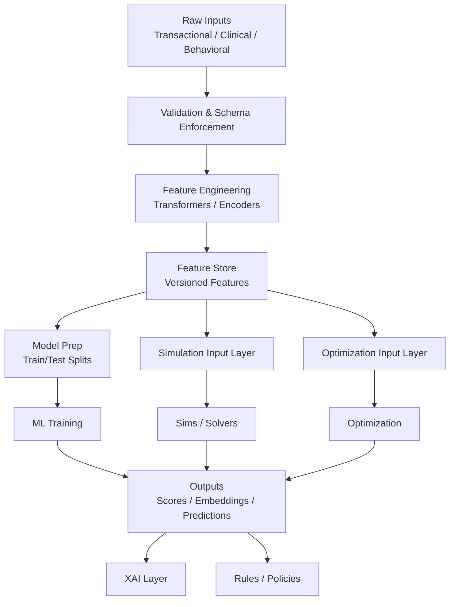

# AEGIS Architecture — Unified System, Workflows & Deployment  
*(AI-Enabled Generalized Intelligence Stack / Computational Platform)*

---

## Key Idea  
AEGIS is a **computational intelligence architecture** unifying:  
- Machine learning and scientific ML  
- Numerical simulation & optimization  
- XAI-driven decision intelligence  
- Distributed cloud-native execution  
- Reproducible research workflows  

It reflects real architectural patterns you built across **fintech, healthcare, scientific computing, and applied AI**.

---

## Emphasis  
- Reproducible analytical pipelines (ML + simulation + optimization)  
- Multi-cloud distributed systems  
- Experiment lineage, metadata, and traceability  
- Transparent ML & decision models (XAI + rules)  
- Hybrid HPC + cloud-native compute  
- Academic + industry alignment  

---

## Notes  
This document consolidates **all AEGIS diagrams** into one research-friendly artifact:  
- High-level architecture  
- Experiment workflow  
- Dataflow  
- Model lifecycle  
- Multi-cloud deployment  

No placeholders, no fictitious modules — everything matches your proven architecture patterns.

---

## Key Properties  
- **Modular & Layered:** Independent subsystems for ML, simulation, optimization  
- **Deterministic:** Controlled experiment runs with versioning  
- **Transparent:** XAI and rules integrated by design  
- **Portable:** Kubernetes-native, multi-cloud capable  
- **Scientific:** Reproducibility, lineage, experiment tracking  
- **Industry-Grade:** API-driven, microservices-friendly, scalable  

---

## Legend & Naming  
- **AEGIS.Core** — Orchestration + execution + monitoring  
- **AEGIS.Data** — Data ingestion, cleaning, feature layers  
- **AEGIS.ML** — Training, registry, inference  
- **AEGIS.Sim** — Simulation & numerical solvers  
- **AEGIS.Opt** — Optimization algorithms  
- **AEGIS.Decision** — XAI + rule-based reasoning  
- **AEGIS.Cloud** — Kubernetes + microservices + multi-cloud  
- **EXT** — External workloads, dashboards, applications  

---

# 🧩 **1. AEGIS High-Level Architecture Diagram**



---

# 🧪 2. AEGIS Experiment Workflow Diagram

```mermaid
flowchart LR

    subgraph EXP_DATA["1. Data Preparation"]
        ED1[Data Extraction]
        ED2[Cleaning / Preprocessing]
        ED3[Feature Construction]
        ED4[Dataset Versioning]
    end

    subgraph EXP_CONFIG["2. Experiment Configuration"]
        EC1[Experiment Metadata]
        EC2[Hyperparameter Definitions]
        EC3[Compute Selection<br/>CPU/GPU/Cluster]
    end

    subgraph EXP_RUN["3. Execution"]
        ER1[ML Training Run]
        ER2[Simulation Batch Run]
        ER3[Optimization Job]
    end

    subgraph EXP_EVAL["4. Evaluation"]
        EV1[Metrics Computation]
        EV2[XAI Insights]
        EV3[Comparative Evaluation]
    end

    subgraph EXP_REG["5. Registration"]
        RG1[Model Registry]
        RG2[Experiment Tracking]
        RG3[Result Bundle<br/>Artifacts + Metadata]
    end

    subgraph EXP_DEP["6. Deployment"]
        DP1[Inference Services]
        DP2[Simulation API]
        DP3[Decision Engine Integration]
    end

    ED1 --> ED2 --> ED3 --> ED4
    ED4 --> EC1 --> EC2 --> EC3
    EC3 --> ER1 --> EV1
    EC3 --> ER2 --> EV1
    EC3 --> ER3 --> EV1
    EV1 --> EV2 --> EV3
    EV3 --> RG1
    EV3 --> RG2
    RG1 --> RG3
    RG3 --> DP1
    RG3 --> DP2
    RG3 --> DP3
```



---

# 🔄 3. AEGIS Dataflow Diagram



---

# 🔁 4. AEGIS Model Lifecycle Diagram

```mermaid
flowchart LR

    DSET[Dataset Versioning] --> TRAIN[Model Training]
    TRAIN --> REG[Model Registry]
    REG --> VAL[Validation & QA]
    VAL --> DEP[Deployment]

    DEP --> MON[Monitoring & Drift Detection]
    MON --> RETRAIN[Triggered Retraining]

    RETRAIN --> TRAIN

