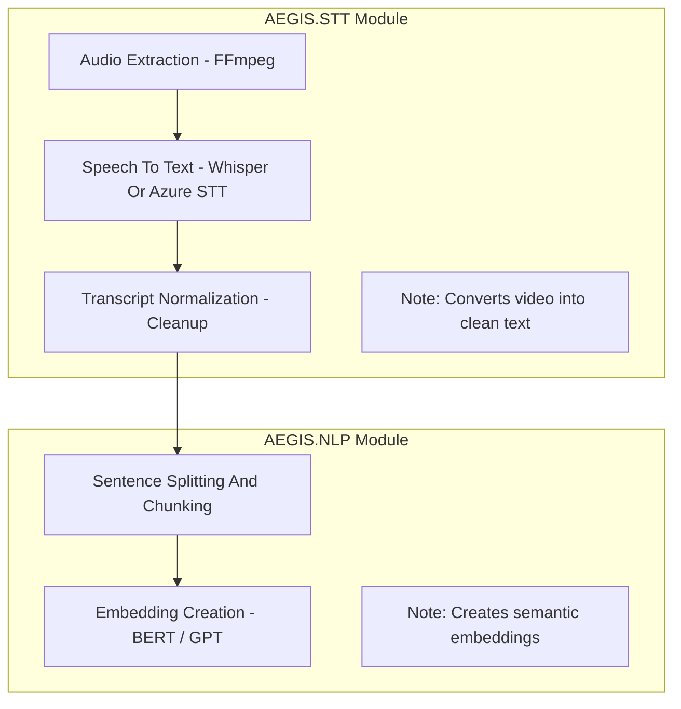
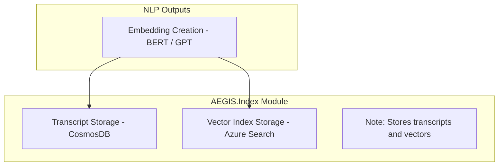

```mermaid
flowchart TB

    %% AEGIS.STT
    subgraph STT [AEGIS.STT Module]
        A1[Audio Extraction - FFmpeg]
        A2[Speech To Text - Whisper Or Azure STT]
        A3[Transcript Normalization - Cleanup]
        STT_NOTE[Note: Converts video into clean text]
    end

    %% AEGIS.NLP
    subgraph NLP [AEGIS.NLP Module]
        A4[Sentence Splitting And Chunking]
        A5[Embedding Creation - BERT / GPT]
        NLP_NOTE[Note: Creates semantic embeddings]
    end

    A1 --> A2 --> A3 --> A4 --> A5
```

```mermaid
flowchart TB

    subgraph NLP [NLP Outputs]
        A5[Embedding Creation - BERT / GPT]
    end

    subgraph INDEX [AEGIS.Index Module]
        A6[Transcript Storage - CosmosDB]
        A7[Vector Index Storage - Azure Search]
        INDEX_NOTE[Note: Stores transcripts and vectors]
    end

    A5 --> A6
    A5 --> A7
```
