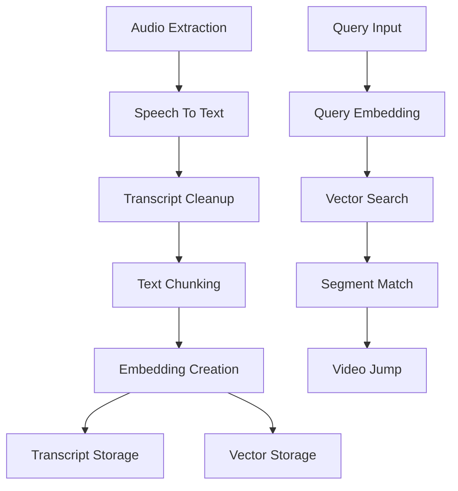

```mermaid
flowchart TD

    A1[Audio Extraction]
    A2[Speech To Text]
    A3[Transcript Cleanup]
    A4[Text Chunking]
    A5[Embedding Creation]
    A6[Transcript Storage]
    A7[Vector Storage]

    Q1[Query Input]
    Q2[Query Embedding]
    Q3[Vector Search]
    Q4[Segment Match]
    Q5[Video Jump]

    A1 --> A2 --> A3 --> A4 --> A5
    A5 --> A6
    A5 --> A7

    Q1 --> Q2 --> Q3 --> Q4 --> Q5
```
