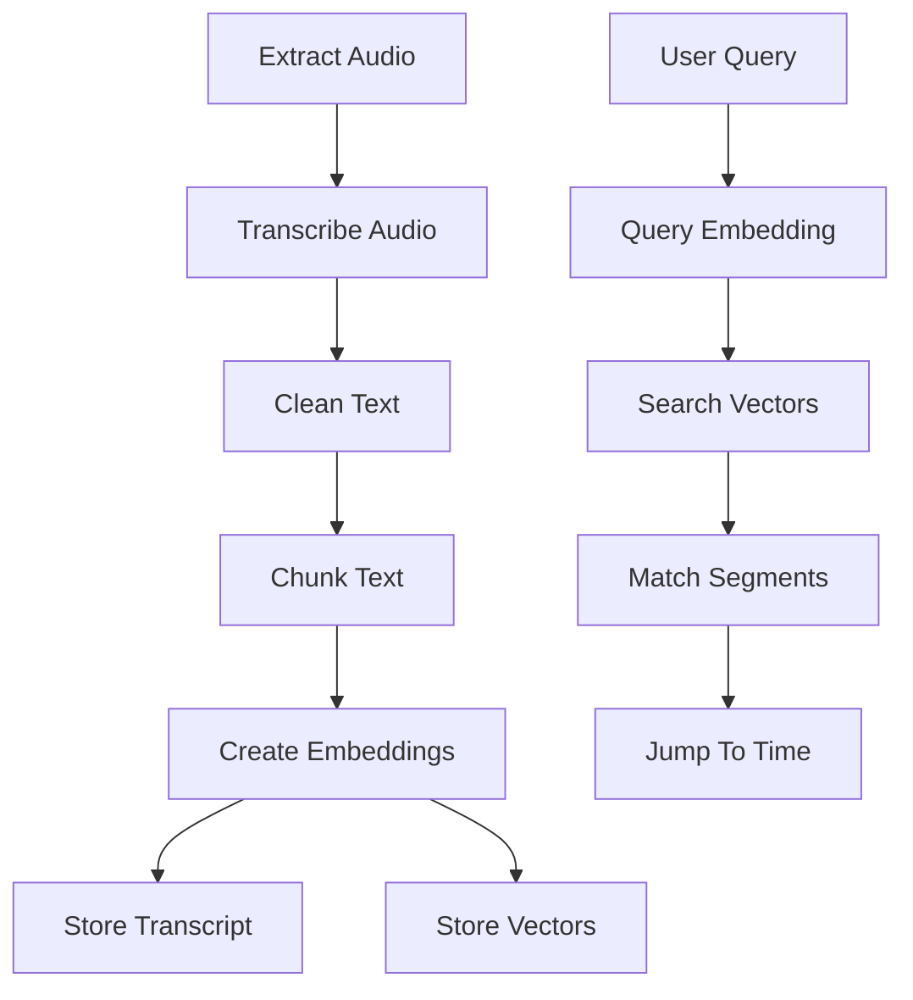

```mermaid
flowchart TD

    A1[Extract Audio]
    A2[Transcribe Audio]
    A3[Clean Text]
    A4[Chunk Text]
    A5[Create Embeddings]
    A6[Store Transcript]
    A7[Store Vectors]

    Q1[User Query]
    Q2[Query Embedding]
    Q3[Search Vectors]
    Q4[Match Segments]
    Q5[Jump To Time]

    A1 --> A2 --> A3 --> A4 --> A5
    A5 --> A6
    A5 --> A7

    Q1 --> Q2 --> Q3 --> Q4 --> Q5
```
