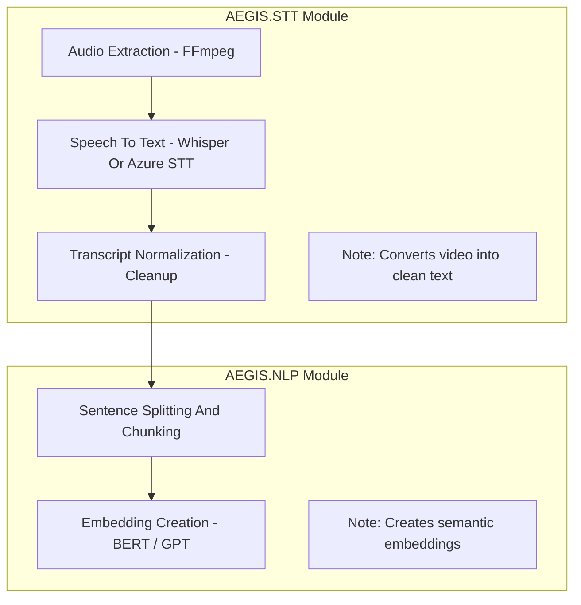
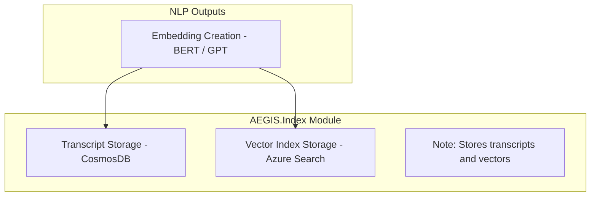
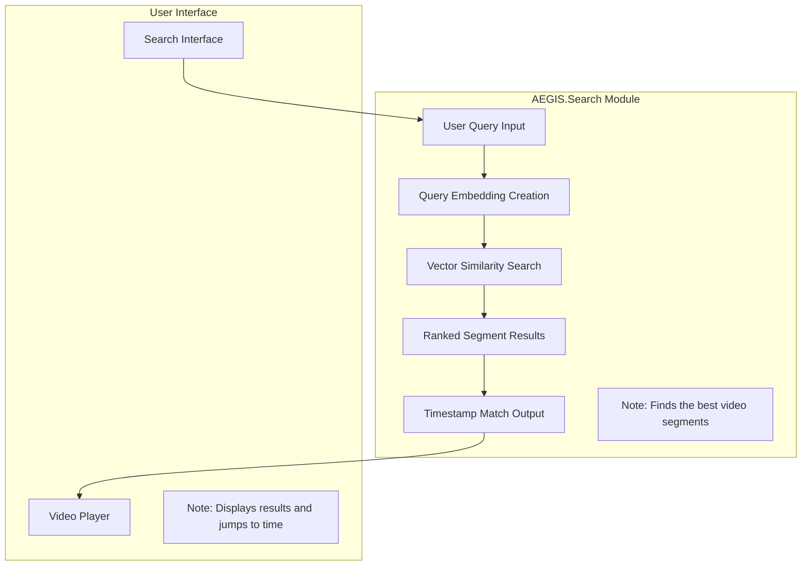

# AEGIS Architecture – Video Intelligence Platform  
A Technical Overview of the Core Processing Pipelines

---

## Introduction

AEGIS is an applied AI platform designed to make long-form video content fully searchable by semantic meaning, not by simple keyword matching.  
It converts raw video into a structured representation of text, embeddings, and time-linked metadata, enabling users to search inside video the same way they search the web.  

This document provides a clear, modular breakdown of the AEGIS architecture using three diagrams:  
1. Speech-to-Text + NLP Pipeline  
2. Indexing Pipeline  
3. Search Pipeline + User Interface

Each part reflects practical, production-oriented AI engineering—built using modern ML/NLP tools such as Whisper, BERT/GPT embeddings, CosmosDB, and Azure Cognitive Search.

---

# Architecture Overview

AEGIS processes video through a sequence of well-defined stages:

1. Speech-to-Text (STT)  
   Extract audio, convert spoken content into text, and clean it for downstream analysis.

2. NLP Processing  
   Split text into meaningful chunks and generate semantic embeddings for retrieval.

3. Indexing and Storage  
   Store transcripts and embeddings in scalable cloud-native databases optimized for search.

4. Semantic Search  
   Convert user queries into embeddings and retrieve the closest matching segments.

5. User Interface Integration  
   Provide a search interface and a video player capable of jumping directly to relevant timestamps.

This layered architecture ensures that AEGIS is modular, extensible, and capable of scaling across large video repositories.

---

# Diagram A — Speech-to-Text + NLP Pipeline

This diagram shows how AEGIS converts raw video into structured, meaningful text representations.  
The pipeline begins with audio extraction (FFmpeg), continues through speech-to-text (Whisper / Azure STT), and produces a clean transcript.  
The NLP stage splits the text into meaningful segments and generates semantic embeddings using BERT / GPT models.  
These embeddings serve as the foundation for indexing and semantic retrieval.

---

# Diagram B — Indexing Pipeline

This diagram shows how AEGIS stores both the structured transcript and the semantic embeddings.  
Transcripts are saved in CosmosDB for fast metadata retrieval.  
Vector embeddings are stored in Azure Search, enabling semantic similarity lookup.  
By indexing both text and vectors, AEGIS ensures precise, timestamp-aware search across long-form videos.

---

# Diagram C — Search Pipeline + User Interface

This diagram shows how users interact with the system to retrieve relevant video moments.  
A natural-language query is converted into an embedding using the same model used during indexing.  
The query embedding is compared with stored vectors to find the closest match.  
Ranked results link directly to timestamps, enabling the video player to jump instantly to the correct moment.

---

## Business Impact

AEGIS accelerates video understanding and navigation through multimodal AI:

- Around **90 percent faster content discovery**  
- Useful in **compliance training**, **corporate learning**, and **media analytics**  
- Demonstrates practical application of **speech recognition, NLP, embeddings, and semantic search** across real enterprise challenges  

---

## Summary

AEGIS shows how modern AI can turn raw video into a searchable knowledge layer.  
By combining speech recognition, NLP processing, vector search, and timestamp linked playback, the platform enables users to jump directly to relevant moments inside long videos.

The architecture is modular. Each components like Speech To Text, NLP, Indexing, Search, and the User Interface can evolve independently as models or search technologies improve.  
This design supports applied industry use cases such as training and compliance, as well as research workflows that require scalable semantic retrieval.

