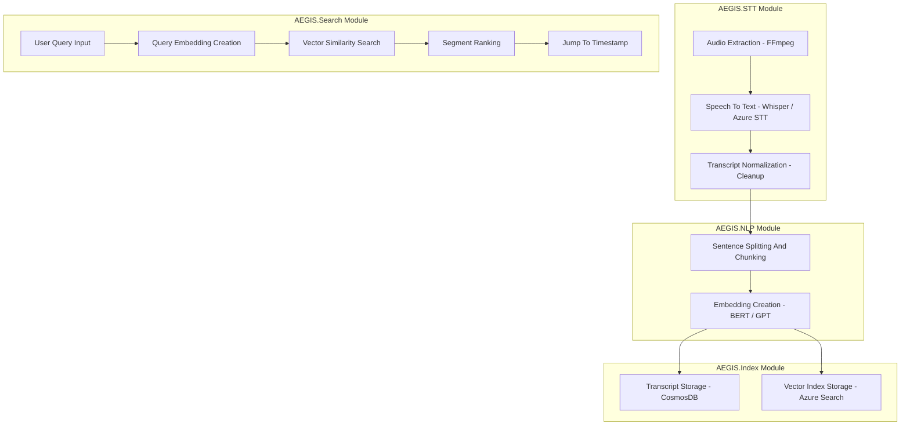

```mermaid
flowchart TD

    %% AEGIS.STT
    subgraph STT [AEGIS.STT Module]
        A1[Audio Extraction - FFmpeg]
        A2[Speech To Text - Whisper / Azure STT]
        A3[Transcript Normalization - Cleanup]
    end

    %% AEGIS.NLP
    subgraph NLP [AEGIS.NLP Module]
        A4[Sentence Splitting And Chunking]
        A5[Embedding Creation - BERT / GPT]
    end

    %% AEGIS.Index
    subgraph INDEX [AEGIS.Index Module]
        A6[Transcript Storage - CosmosDB]
        A7[Vector Index Storage - Azure Search]
    end

    %% AEGIS.Search
    subgraph SEARCH [AEGIS.Search Module]
        Q1[User Query Input]
        Q2[Query Embedding Creation]
        Q3[Vector Similarity Search]
        Q4[Segment Ranking]
        Q5[Jump To Timestamp]
    end

    %% Pipeline
    A1 --> A2 --> A3 --> A4 --> A5
    A5 --> A6
    A5 --> A7

    Q1 --> Q2 --> Q3 --> Q4 --> Q5
```
