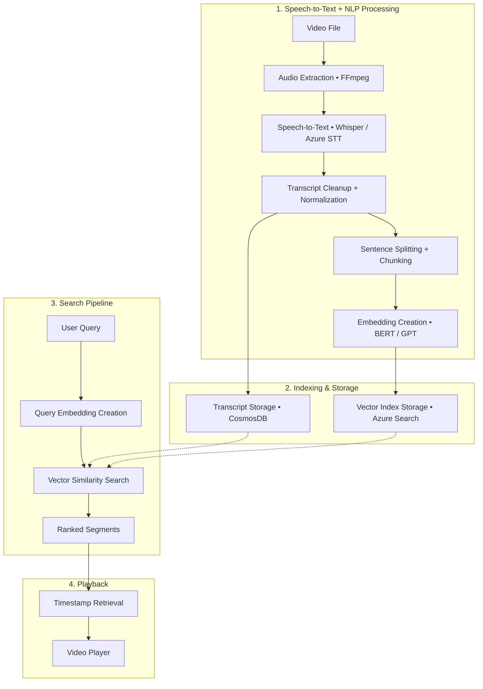

# Aegis Diagram 1 — End-to-End Architecture Overview

## **This diagram shows the whole system at once, from video input → transcript → embeddings → index → search → playback.**

```mermaid
flowchart TB

    %% ---------------------------
    %% STT + NLP Processing Section
    %% ---------------------------
    subgraph STT_NLP [1. Speech-to-Text + NLP Processing]
        direction TB
        V[Video File]
        A1[Audio Extraction • FFmpeg]
        A2[Speech-to-Text • Whisper / Azure STT]
        A3[Transcript Cleanup + Normalization]

        A4[Sentence Splitting + Chunking]
        A5[Embedding Creation • BERT / GPT]

        V --> A1 --> A2 --> A3 --> A4 --> A5
    end

    %% ---------------------------
    %% Storage + Indexing Section
    %% ---------------------------
    subgraph INDEX [2. Indexing & Storage]
        direction TB
        S1[Transcript Storage • CosmosDB]
        S2[Vector Index Storage • Azure Search]

        A3 --> S1
        A5 --> S2
    end

    %% ---------------------------
    %% Search Section
    %% ---------------------------
    subgraph SEARCH [3. Search Pipeline]
        direction TB
        Q[User Query]
        Q1[Query Embedding Creation]
        Q2[Vector Similarity Search]
        Q3[Ranked Segments]
        Q --> Q1 --> Q2 --> Q3
    end

    %% Connect Index to Search
    S1 -.-> Q2
    S2 -.-> Q2

    %% ---------------------------
    %% Playback Section
    %% ---------------------------
    subgraph PLAYBACK [4. Playback]
        direction TB
        T[Timestamp Retrieval]
        P[Video Player]
        Q3 --> T --> P
    end

```
