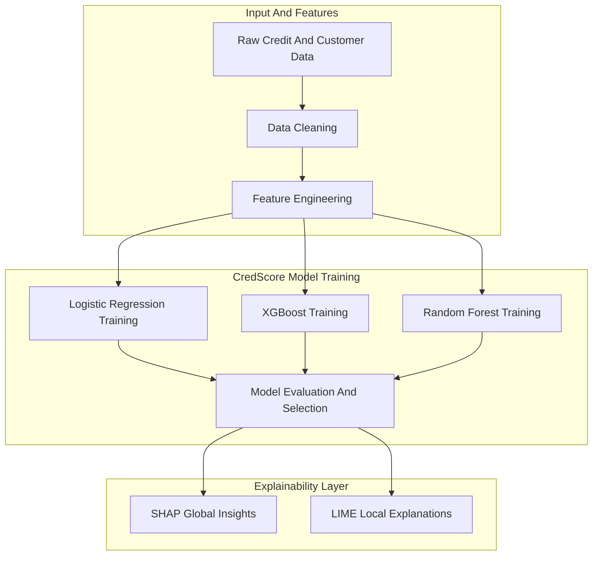
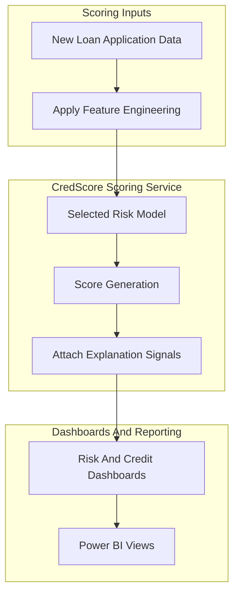
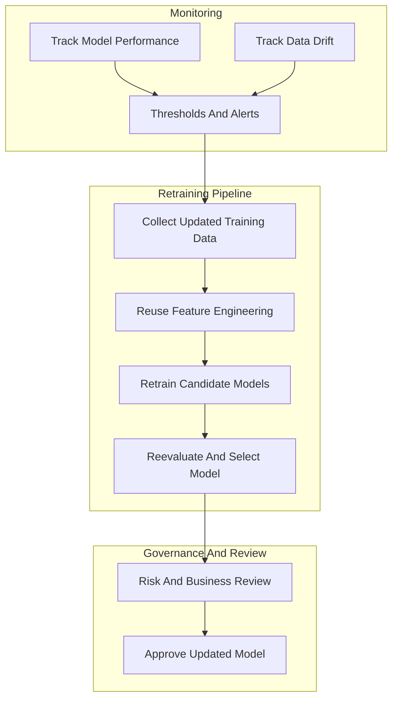

# CredScore Architecture – Explainable AI Risk Scoring  
A Transparent, Modular Credit Risk Pipeline (2022–2023)

---

## Introduction

CredScore is an explainable credit risk scoring system designed for regulated lending environments.  
It transforms raw credit and customer data into transparent, audit-ready risk scores that business teams and regulators can understand.  
The platform focuses on clarity, fairness, and accountability, combining traditional ML models with modern explainability techniques.

This document provides a modular breakdown of the CredScore system, using three diagrams:
1. Training and Explainability Pipeline  
2. Scoring and Dashboard Integration  
3. Monitoring and Retraining Loop

Each diagram reflects practical, production-oriented ML engineering with tools such as Scikit-learn, SHAP, LIME, Azure ML, and Power BI.

---

# Architecture Overview

CredScore follows a structured sequence of processing steps:

1. **Data Preparation and Feature Engineering**  
   Clean credit data, derive features, and build model-ready inputs.

2. **Model Training and Evaluation**  
   Train multiple models (Logistic Regression, XGBoost, Random Forest) and select the best candidate.

3. **Explainability Layer**  
   Use SHAP and LIME to provide global and local reasoning for every risk score.

4. **Scoring and Dashboards**  
   Apply the model to new applications, attach explanation signals, and deliver insights through Power BI dashboards.

5. **Monitoring and Retraining**  
   Track drift and model performance, triggering a retraining cycle when needed.

This modular approach allows CredScore to adapt as regulations evolve, data changes, or new modeling techniques become available.

---

# Diagram A — Training and Explainability Pipeline

This diagram shows how raw credit data becomes a trained, transparent risk scoring model.  
Data is cleaned and transformed into engineered features, then passed into several candidate models.  
After evaluation, the selected model is paired with SHAP and LIME to create clear, actionable explanations.

---

# Diagram B — Scoring And Dashboard Integration

This diagram shows how CredScore operates in production.  
New loan applications are processed through the same feature engineering logic and scored using the selected model.  
Scores, along with explanation indicators, are pushed to Power BI dashboards where risk analysts can explore model reasoning and decision signals.

---

# Diagram C — Monitoring And Retraining Loop

This diagram shows how CredScore remains accurate and compliant over time.  
The system monitors model performance and data drift.  
When significant changes are detected, it triggers a retraining cycle using updated data and the same training pipeline shown in Diagram A.  
Risk teams review and approve new models before deployment.

---

## Business Impact

CredScore improves both operational efficiency and model transparency:

- Around **30 percent faster loan processing**  
- Around **15 percent improvement in approval accuracy**  
- **Zero black box scoring**, with full explainability for regulators and auditors  

The combination of accuracy and interpretability supports better decision-making and builds trust across risk, compliance, and business teams.

---

## Summary

CredScore is a modular, explainable AI system for credit risk scoring.  
By integrating feature engineering, classical ML, SHAP and LIME explanations, and Power BI dashboards, the platform provides both predictive strength and clear, human-understandable reasoning.

Its design supports ongoing monitoring, retraining, and governance, making it suitable for production lending workflows as well as research and experimentation in explainable machine learning.
