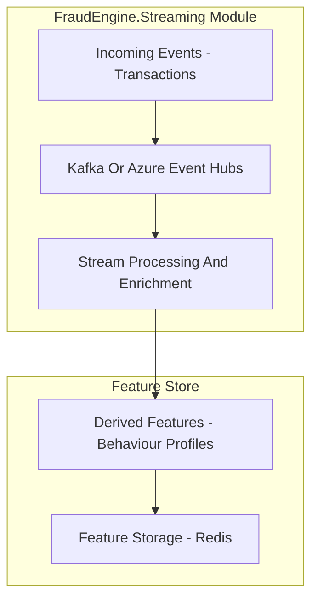
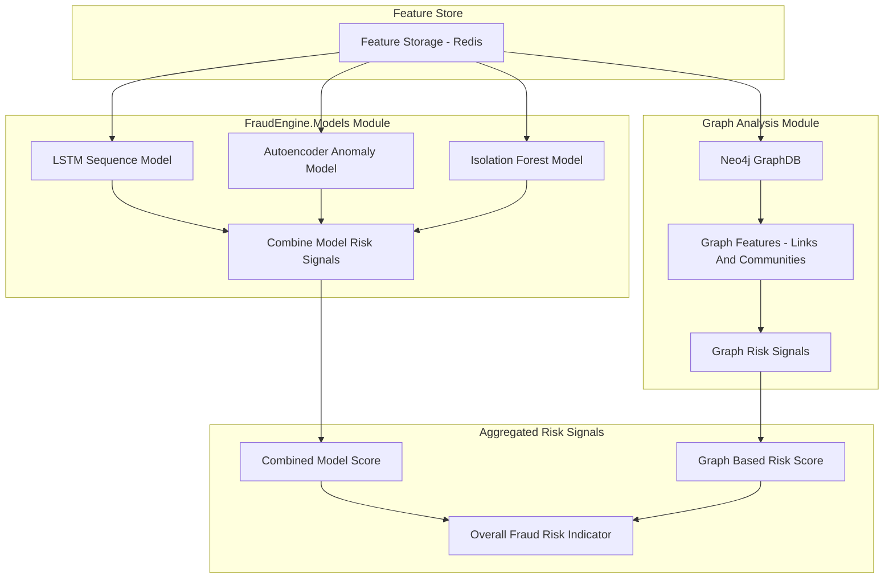
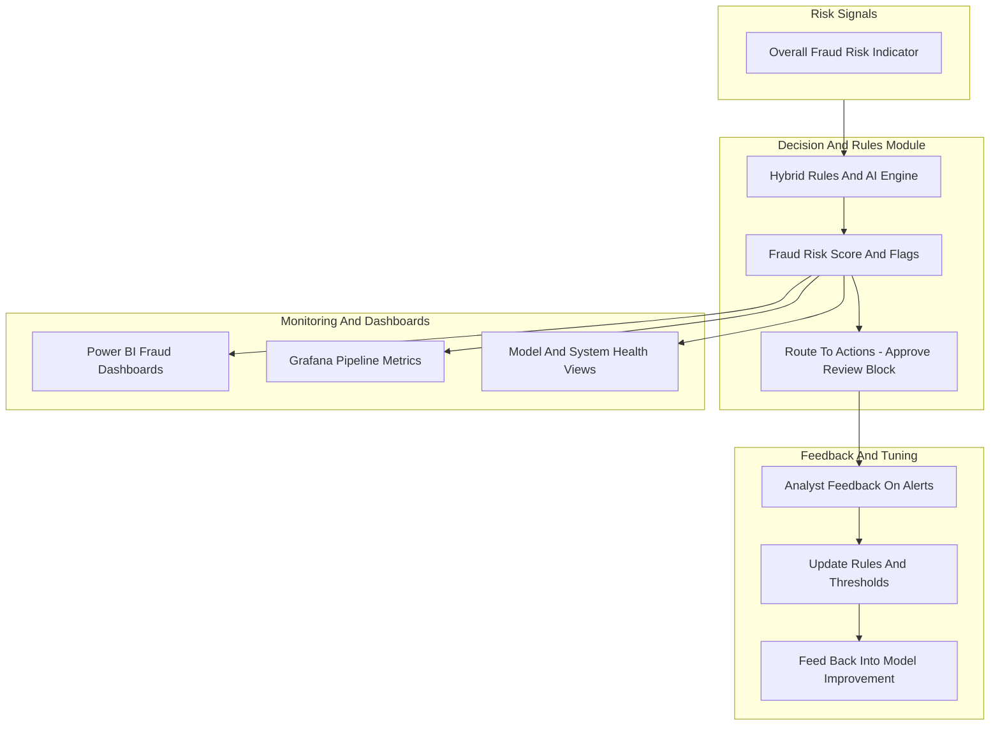

# Fraud Engine Architecture – AI Driven Fraud Detection  
Real Time Streaming, Graph And Hybrid AI (2023)

---

## Introduction

The Fraud Engine is an AI driven fraud detection system designed for **real time** transaction monitoring.  
It combines streaming data, machine learning models, and graph analytics to detect suspicious patterns early, while reducing false positives.

The platform is built around:

- Streaming pipelines using Kafka or Azure Event Hubs  
- A feature store for fast access to behavioural features  
- Multiple ML models for anomaly and sequence detection  
- Graph based analysis to detect complex fraud rings  
- Dashboards for monitoring and operations

This document describes the architecture using three diagrams:
1. Streaming And Feature Pipeline  
2. Model Fusion And Graph Based Detection  
3. Decision, Alerts And Monitoring

---

# Architecture Overview

The Fraud Engine follows a flow from **live events** to **real time decisions**:

1. **Streaming Ingestion**  
   Transactions and related events are ingested through Kafka or Azure Event Hubs.

2. **Feature Engineering And Feature Store**  
   Streams are enriched, features are computed, and stored in a fast feature store.

3. **Model Scoring And Graph Analysis**  
   Multiple models (LSTM, Autoencoders, Isolation Forest) generate risk signals, combined with graph based risk indicators from Neo4j.

4. **Hybrid Decision And Rules**  
   AI scores and rules are combined to produce final fraud risk flags.

5. **Monitoring And Feedback**  
   Power BI and Grafana dashboards show risk trends, model behaviour, and system health, feeding into continuous improvement.

This modular structure allows the engine to scale with higher volumes, new models, and evolving fraud patterns.

---

# Diagram A — Streaming And Feature Pipeline

This diagram shows how events enter the system and become enriched features for downstream models.  
Incoming transactions and events are ingested via Kafka or Azure Event Hubs, processed in a streaming layer, and written into a feature store such as Redis.  
The result is a low latency pipeline that keeps recent behavioural data ready for fraud detection models.

---

# Diagram B — Model Fusion And Graph Based Detection

This diagram shows how the Fraud Engine uses multiple models and graph analytics to detect fraud patterns.  
The feature store feeds different model types: sequence models for temporal patterns, anomaly models for unusual behaviour, and tree based models for structured signals.  
In parallel, a graph database such as Neo4j is used to model relationships between entities and surface complex fraud rings.

---

# Diagram C — Decision, Alerts And Monitoring

This diagram shows how risk signals from models and graph analysis are turned into actions and monitored over time.  
A hybrid decision layer combines AI scores with rules, producing fraud flags and recommended actions such as approve, review, or block.  
Dashboards in Power BI and Grafana show trends, alert volumes, and system metrics, supporting both operations and continuous improvement.

---

## Business Impact

The Fraud Engine was designed to reduce losses while keeping alert quality high:

- Around **40 percent reduction in fraud losses**  
- Around **20 percent faster fraud detection time** through real time scoring  
- Reduction of false positives using **hybrid rules and AI models**, improving analyst productivity  

---

## Summary

The Fraud Engine is a real time, AI driven fraud detection platform that combines streaming, feature stores, multiple ML models, and graph analysis.  
Its modular design allows each part of the system like streaming, features, models, graph analytics, decision logic, and dashboards to evolve as fraud patterns and technologies change.

By providing both powerful detection capabilities and operational visibility, it supports proactive fraud management in modern, high volume environments.

---

## 📘 Fraud Engine Diagram Suite

- 🔹 **End-to-End Overview**  
  [`fraud-engine-overview.md`](./fraud-engine/fraud-engine-overview.md)

- 🔹 **Feature Extraction Flow**  
  [`fraud-engine-feature-flow.md`](./fraud-engine/fraud-engine-feature-flow.md)

- 🔹 **Detection Pipeline**  
  [`fraud-engine-detection-pipeline.md`](./fraud-engine/fraud-engine-detection-pipeline.md)

- 🔹 **Evaluation Pipeline**  
  [`fraud-engine-evaluation.md`](./fraud-engine/fraud-engine-evaluation.md)

- 🔹 **Deployment Architecture**  
  [`fraud-engine-deployment.md`](./fraud-engine/fraud-engine-deployment.md)

