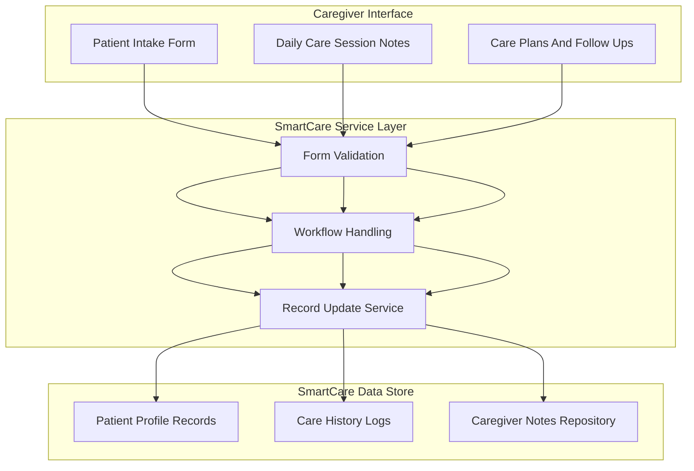
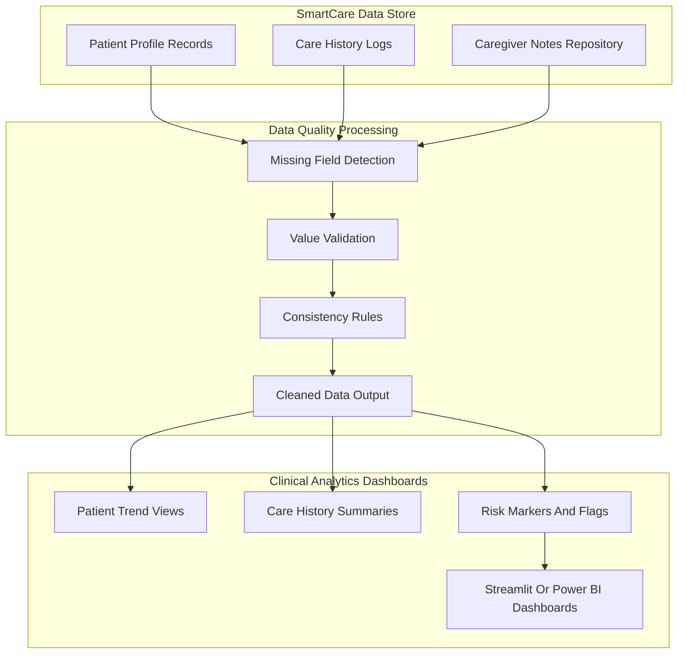
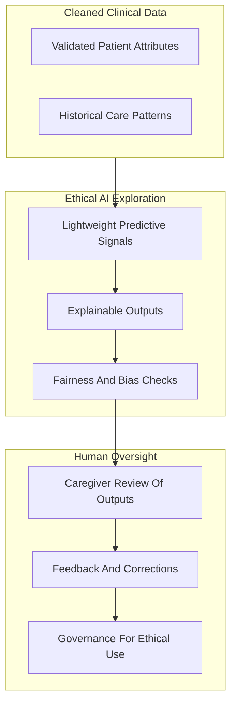

# SmartCare Architecture – Eldercare CRM  
From Early Health Tech to Modern Ethical AI Prototype (2003–2006 → Revived 2023)

---

## Introduction

SmartCare began as an early eldercare CRM system (2003–2006), predating today’s EHR and EMR platforms.  
Its original purpose was to support caregivers with secure patient workflows, activity records, and care coordination.

The platform was later **modernized** for research, transforming the historic system into a working prototype for:

- Ethical health-tech architectures  
- Secure clinical workflows  
- Data quality automation  
- Lightweight analytics for patient well-being  

The updated version uses a modern stack (Python, REST APIs, Streamlit) while maintaining the simplicity and clarity of the original design.

This document breaks the architecture into three diagrams:
1. Patient And Caregiver Workflow  
2. Data Quality And Clinical Analytics  
3. Ethical AI Exploration Loop

---

# Architecture Overview

SmartCare’s modernized platform follows a clean, modular flow:

1. **Caregiver and Patient Interactions**  
   Intake forms, session notes, and care workflows captured through a simple interface.

2. **Data Quality Processing**  
   Automated checks improve consistency, fill missing fields, and validate key clinical attributes.

3. **Clinical Analytics Dashboards**  
   Lightweight dashboards highlight patient trends, risk markers, and care history.

4. **Ethical AI Exploration**  
   Experimental models used strictly for research purposes—never clinical diagnosis—to explore transparency and fairness.

5. **Feedback And Governance**  
   Caregivers can review analytics outputs and provide corrections, supporting human-in-the-loop refinement.

This architecture preserves the system’s original purpose while exploring modern, responsible health-tech patterns.

---

# Diagram A — Patient And Caregiver Workflow

This diagram shows how SmartCare captures information from caregivers and organizes it into secure patient records.  
The workflow includes patient intake, daily updates, session notes, and follow-up actions.  
Captured information flows into a simple service layer and then into the SmartCare data store.

---

# Diagram B — Data Quality And Clinical Analytics

This diagram shows how SmartCare improves data quality and generates clinical-style dashboards.  
Incoming records undergo automated checks to ensure consistency and completeness.  
The cleaned data drives analytics views that help caregivers monitor patient well-being trends.

---

# Diagram C — Ethical AI Exploration Loop

This diagram shows how SmartCare’s revamped version supports **ethical AI experimentation**.  
These models are research-only prototypes used to study transparency, fairness, and user comprehension.  
A feedback loop ensures that caregivers can verify outputs, reinforcing human oversight.

---

## Business Impact And Legacy

SmartCare demonstrated early innovation in digital eldercare (2003–2006).  
Its revival provides:

- A clean prototype for modern, ethical health-tech architectures  
- Secure handling of patient workflows  
- Automated data quality improvements  
- Simple clinical analytics for caregivers  
- A safe environment to explore transparent, responsible AI  

---

## Summary

SmartCare is a modernized version of an early eldercare CRM, rebuilt as an ethical, research-oriented health tech prototype.  
Its modular architecture supports patient workflows, automated data quality checks, clinical analytics dashboards, and exploratory AI models with strong human oversight.

The system offers both historical value and forward-looking insights into responsible health-tech design.

---

## 📘 SmartCare Diagram Suite

- 🔹 **End-to-End Overview**  
  [`smartcare-overview.md`](./smartcare/smartcare-overview.md)

- 🔹 **Feature Pipeline**  
  [`smartcare-feature-pipeline.md`](./smartcare/smartcare-feature-pipeline.md)

- 🔹 **Modeling Pipeline**  
  [`smartcare-modeling-pipeline.md`](./smartcare/smartcare-modeling-pipeline.md)

- 🔹 **Explainability Flow**  
  [`smartcare-explainability-flow.md`](./smartcare/smartcare-explainability-flow.md)

- 🔹 **Deployment Architecture**  
  [`smartcare-deployment.md`](./smartcare/smartcare-deployment.md)

